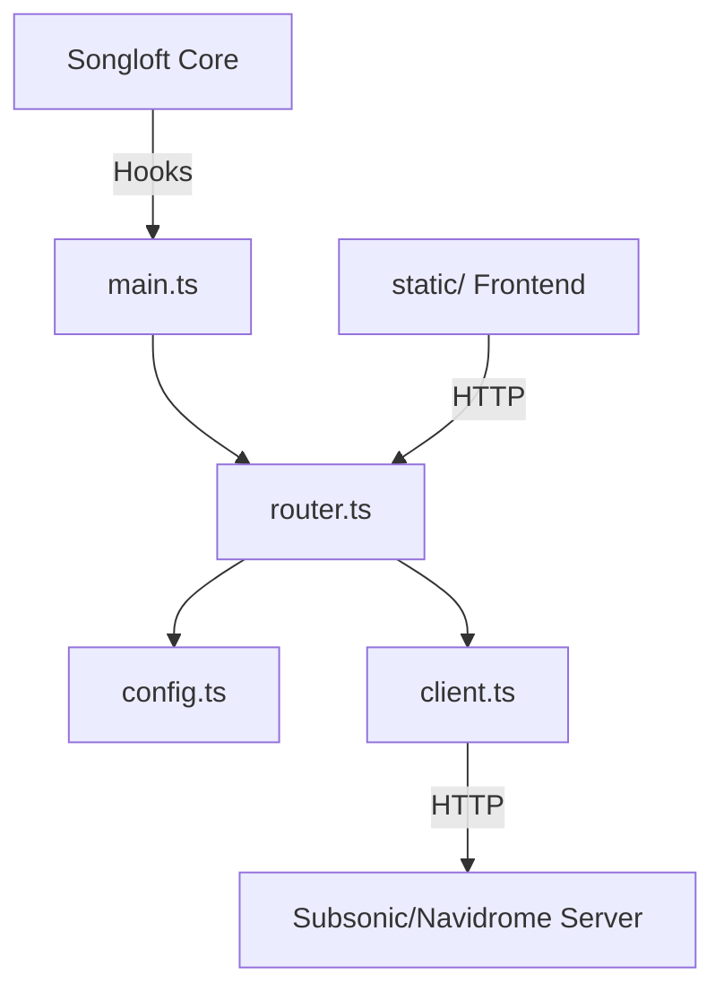

# 项目架构分析

## 模块依赖关系图

## 核心功能流
用户通过 Frontend (`static/`) 发起请求 -> 插件 `router.ts` 拦截处理 -> 读写配置或转发给 `client.ts` -> 组装参数请求远端 Subsonic Server -> 返回统一格式的 SearchResultItem 数据。

## 架构模式
B/S (Browser/Server) with Global Context Plugin SDK Architecture

## 模块接口与通信方式
- Backend <-> Frontend: Local HTTP requests via `songloft-plugin-sdk` router
- Backend <-> Subsonic Server: RESTful API over HTTP with token auth

## 关键模块标记
- src: contains TypeScript source files
- static: contains JavaScript source files

